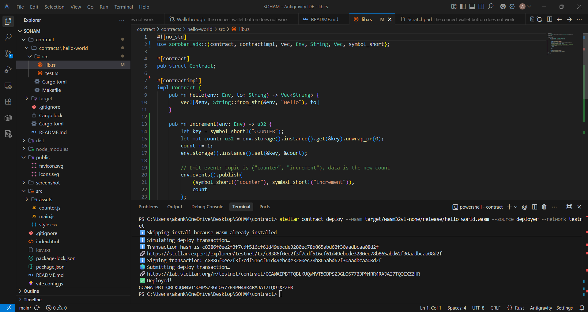

# ASTRA — Stellar Testnet Wallet Dashboard

A clean, minimal, and fully functional **Stellar Testnet** wallet dashboard built with Vite + Vanilla JS. Connect your Freighter or Albedo wallet, view your balances, add custom tokens, send to federated addresses, invoke smart contracts, and send real on-chain testnet transactions — all from one sleek interface.

---

## Features

### New Premium Upgrades
- **Dynamic Glassmorphism UI**: Beautiful frosted glass cards with 3D hover effects, subtle glowing borders, and an animated gradient mesh background.
- **Multi-Wallet Support**: Seamlessly connect using either **Freighter** or **Albedo** wallet.
- **Multi-Asset Manager**: Add trustlines for custom Testnet tokens and automatically detect and manage your entire portfolio.
- **Portfolio Value Chart**: A real-time `Chart.js` doughnut chart visualizing your asset distribution.
- **Federated Address Support**: Send funds directly to human-readable addresses (e.g., `bob*stellar.org`); Astra resolves them under the hood!
- **Smart Contract Integration**: Invoke Soroban Smart Contracts deployed on the Testnet directly from the UI.
- **Robust Error Handling**: The app safely handles over 3 major error types: Wallet disconnects, User signature rejections, and Smart Contract execution/simulation failures.

### Core Functionality
- **Live XLM Balance** — auto-refreshes with an animated counter.
- **Single Transfer & Split Bill Calculator** — send XLM to one or multiple recipients in one multi-op transaction.
- **Account Watchlist** — monitor any Stellar address balance, persisted in localStorage.
- **Recent Payments Feed** — real-time streaming of incoming & outgoing transactions.
- **Transaction Inspector Drawer** — view memo, fee, ledger sequence for any payment.
- **Friendbot Faucet** — one-click fund your account with 10,000 testnet XLM.
- **StellarExpert Links** — every transaction links directly to the block explorer.

---

## Screenshots

### 1. Landing Page — Connect Your Wallet
> Clean disconnected state prompting you to connect the Freighter extension.


---

### 2. Wallet Connected — Balance Displayed
> After connecting, your full public key, live XLM balance, Account Watchlist, and Recent Payments are shown.


---

### 3. Signing a Testnet Transaction
> Freighter pops up to confirm the transaction. The app shows a step-by-step progress modal (Building → Signing → Submitting → Complete).


---

### 4. Transaction Result — Payment Complete
> The success modal displays the transaction hash and a direct link to StellarExpert.


---

### 5. Verified on StellarExpert
> The confirmed transaction on the Stellar Testnet block explorer, showing status, fee, ledger, and signers.


---

### 6. Smart Contract Integration
> Interact with the Counter smart contract directly from the dashboard, tracking increments and on-chain events.



---

## Tech Stack

| Layer | Technology |
|---|---|
| Framework | [Vite](https://vitejs.dev) (vanilla JS) |
| Wallet | Freighter API v6 & Albedo Integration |
| Blockchain | [@stellar/stellar-sdk](https://www.npmjs.com/package/@stellar/stellar-sdk) v15 |
| Network | Stellar Testnet (`horizon-testnet.stellar.org`) |
| Styling | Vanilla CSS (Glassmorphism + Animated Gradients) |
| Visualization | [Chart.js](https://www.chartjs.org/) |
| Fonts | Inter + JetBrains Mono (Google Fonts) |

---

## Setup — Run Locally

### Prerequisites
- [Node.js](https://nodejs.org) v18 or higher
- [Freighter Wallet](https://freighter.app) Chrome extension installed and set to **Testnet**

### Steps

**1. Clone the repository**
```bash
git clone https://github.com/sohamrpatil4220/Astra.git
cd Astra
```

**2. Install dependencies**
```bash
npm install
```

**3. Start the development server**
```bash
npm run dev
```

**4. Open in browser**
```
http://localhost:5173  (or next available port)
```

**5. Connect Wallet**
- Make sure Freighter is set to **Test Net** (not Mainnet)
- Click **Connect Wallet** in the top-right corner
- Approve the connection in the Freighter popup

**6. Fund your account (first time)**
- Click **"Request 10,000 Testnet XLM"** to use the Friendbot faucet
- Your balance will appear within a few seconds

---

## Project Structure

```text
Astra/
├── index.html          # Main HTML shell, layouts & templates
├── src/
│   ├── main.js         # Core application logic (Wallet, Transactions, UI)
│   └── style.css       # Dynamic Glassmorphism Design System
├── public/
│   └── favicon.svg
├── contract/           # Rust Soroban Smart Contracts
├── screenshot/         # App screenshots (s1–s6)
├── vite.config.js      # Vite + Node polyfills config
└── package.json
```

---

## Notes

- This app runs **exclusively on the Stellar Testnet** — no real funds are used.
- Your wallet session is saved in `localStorage` so you stay connected on reload.
- The `node_modules/`, `dist/`, and compiled wasm targets are excluded from the repository.

---

## License

MIT — free to use, fork, and build upon.
