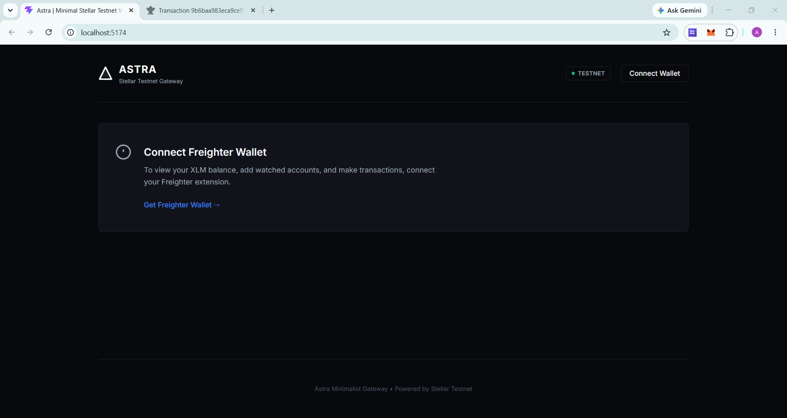
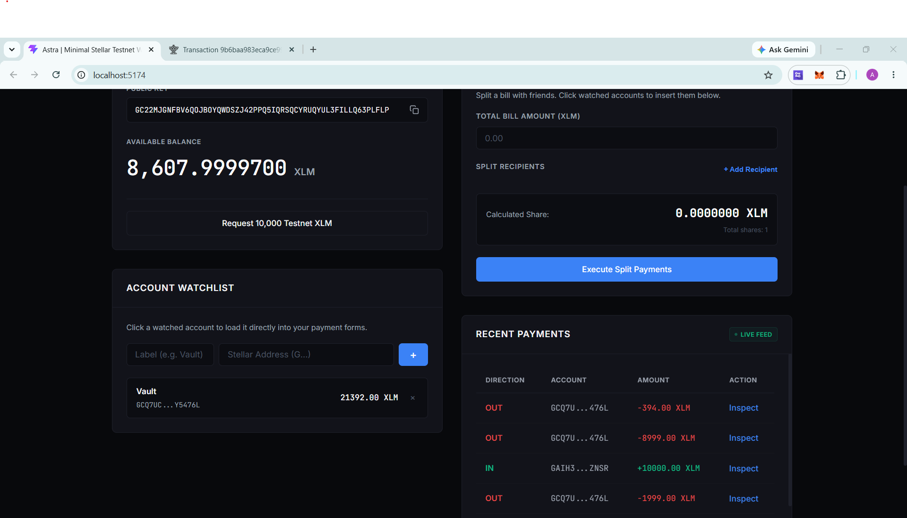
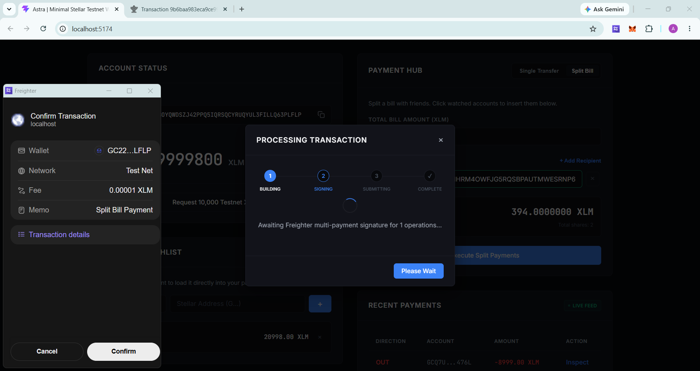
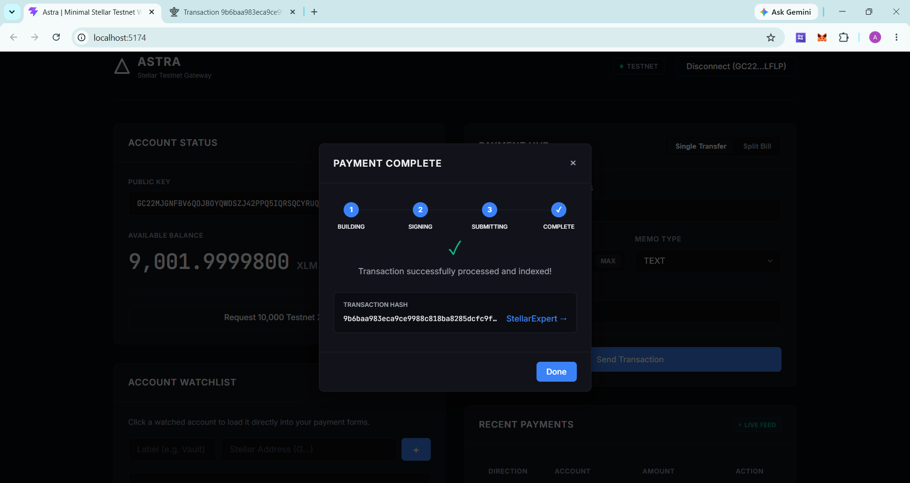
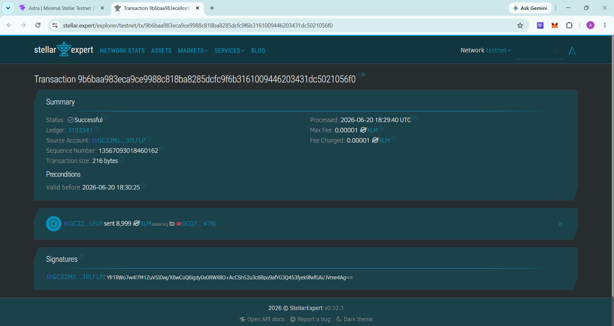

# ▲ ASTRA — Stellar Testnet Wallet Dashboard

A clean, minimal, and fully functional **Stellar Testnet** wallet dashboard built with Vite + Vanilla JS. Connect your Freighter wallet, view your XLM balance, monitor watched accounts, and send real on-chain testnet transactions — all from one sleek interface.

---

## ✨ Features

- 🔗 **One-click Wallet Connect** via [Freighter](https://freighter.app) browser extension
- 💰 **Live XLM Balance** — auto-refreshes every 10 seconds with animated counter
- 📤 **Single Transfer** — send XLM to any Stellar address with optional TEXT / ID memo
- 🧾 **Split Bill Calculator** — divide a bill among multiple recipients in one multi-op transaction
- 👁️ **Account Watchlist** — monitor any Stellar address balance, persisted in localStorage
- 📜 **Recent Payments Feed** — real-time streaming of incoming & outgoing transactions
- 🔍 **Transaction Inspector Drawer** — view memo, fee, ledger sequence for any payment
- 🚰 **Friendbot Faucet** — one-click fund your account with 10,000 testnet XLM
- 🌐 **StellarExpert Links** — every transaction links directly to the block explorer

---

## 🖥️ Screenshots

### 1. Landing Page — Connect Your Wallet
> Clean disconnected state prompting you to connect the Freighter extension.



---

### 2. Wallet Connected — Balance Displayed
> After connecting, your full public key, live XLM balance, Account Watchlist, and Recent Payments are shown.



---

### 3. Signing a Testnet Transaction
> Freighter pops up to confirm the transaction. The app shows a step-by-step progress modal (Building → Signing → Submitting → Complete).



---

### 4. Transaction Result — Payment Complete
> The success modal displays the transaction hash and a direct link to StellarExpert.



---

### 5. Verified on StellarExpert
> The confirmed transaction on the Stellar Testnet block explorer, showing status, fee, ledger, and signers.



---

## 🛠️ Tech Stack

| Layer | Technology |
|---|---|
| Framework | [Vite](https://vitejs.dev) (vanilla JS) |
| Wallet | [@stellar/freighter-api](https://www.npmjs.com/package/@stellar/freighter-api) v6 |
| Blockchain | [@stellar/stellar-sdk](https://www.npmjs.com/package/@stellar/stellar-sdk) v15 |
| Network | Stellar Testnet (`horizon-testnet.stellar.org`) |
| Styling | Vanilla CSS (dark theme, glassmorphism) |
| Fonts | Inter + JetBrains Mono (Google Fonts) |

---

## 🚀 Setup — Run Locally

### Prerequisites
- [Node.js](https://nodejs.org) v18 or higher
- [Freighter Wallet](https://freighter.app) Chrome extension installed and set to **Testnet**

### Steps

**1. Clone the repository**
```bash
git clone https://github.com/sohamrpatil4220/Astra.git
cd Astra
```

**2. Install dependencies**
```bash
npm install
```

**3. Start the development server**
```bash
npm run dev
```

**4. Open in browser**
```
http://localhost:5173
```

**5. Connect Wallet**
- Make sure Freighter is set to **Test Net** (not Mainnet)
- Click **Connect Wallet** in the top-right corner
- Approve the connection in the Freighter popup

**6. Fund your account (first time)**
- Click **"Request 10,000 Testnet XLM"** to use the Friendbot faucet
- Your balance will appear within a few seconds

---

## 📁 Project Structure

```
Astra/
├── index.html          # Main HTML shell & layout
├── src/
│   ├── main.js         # All app logic (wallet, transactions, UI)
│   └── style.css       # Dark theme design system
├── public/
│   └── favicon.svg
├── screenshot/         # App screenshots (s1–s5)
├── vite.config.js      # Vite + Node polyfills config
└── package.json
```

---

## ⚠️ Notes

- This app runs **exclusively on the Stellar Testnet** — no real funds are used
- Your wallet session is saved in `localStorage` so you stay connected on reload
- The `node_modules/` and `dist/` directories are excluded from the repository

---

## 📄 License

MIT — free to use, fork, and build upon.
